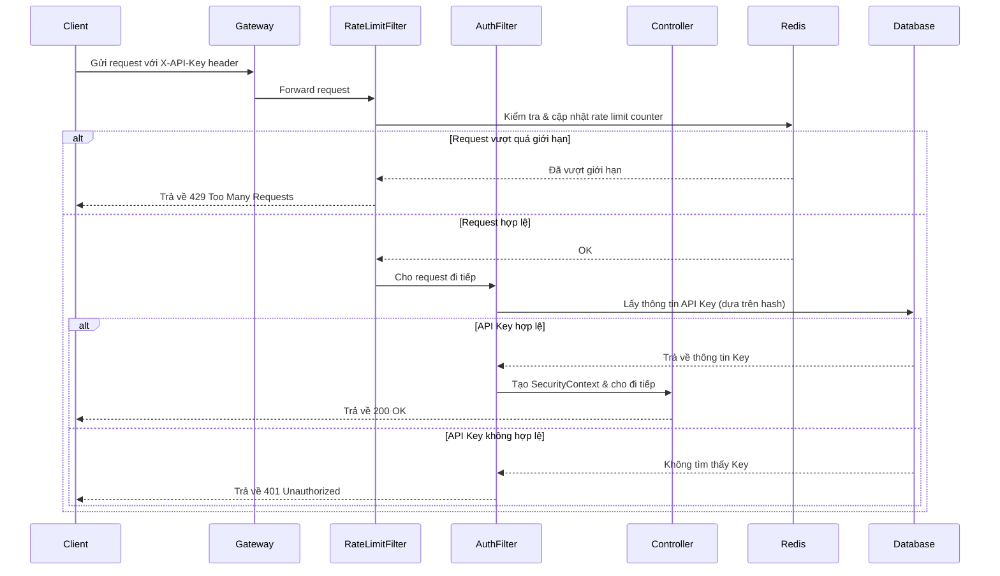

# Xác thực bằng API Key: Hướng dẫn toàn diện

## 1. API Key là gì? (Giải thích cho người không chuyên)

Thử tưởng tượng bạn muốn vào một câu lạc bộ độc quyền. Thay vì dùng chứng minh thư (giống như tên người dùng và mật khẩu), bạn được cấp một chiếc thẻ thành viên đặc biệt. Chiếc thẻ này không có tên hay ảnh của bạn, nhưng nhân viên bảo vệ biết rằng ai cầm thẻ này thì được phép vào.

**API Key chính là chiếc thẻ thành viên đó.**

Nó là một chuỗi ký tự độc nhất cấp cho một ứng dụng (hoặc một người dùng) để nó có thể truy cập vào một dịch vụ hoặc một hệ thống khác (gọi là API). Khi ứng dụng của bạn muốn "nói chuyện" với dịch vụ kia, nó sẽ chìa cái "thẻ" API Key này ra để chứng minh mình là "người quen" và được phép truy cập.

**Ví dụ đời thực:**
*   **Ứng dụng thời tiết trên điện thoại của bạn:** Nó dùng một API Key để hỏi thông tin thời tiết từ một máy chủ lớn. Máy chủ này dựa vào API Key để biết yêu cầu đến từ ứng dụng hợp lệ và trả về dữ liệu nhiệt độ, độ ẩm...
*   **Website đặt vé máy bay:** Khi bạn tìm chuyến bay, website này có thể dùng API Key để lấy dữ liệu từ các hãng hàng không khác nhau.

**Tóm lại:** API Key là một phương thức xác thực đơn giản, giống như một chiếc chìa khóa, cho phép các chương trình máy tính truy cập và sử dụng tài nguyên của nhau một cách có kiểm soát.

## 2. Ưu và Nhược điểm

| Ưu điểm                                       | Nhược điểm                                                    |
| --------------------------------------------- | ------------------------------------------------------------- |
| **Dễ sử dụng và triển khai:** Rất đơn giản cho cả bên cấp và bên sử dụng. | **Kém an toàn hơn:** Nếu bị lộ, kẻ gian có thể dùng nó ngay lập tức. |
| **Dễ theo dõi và quản lý:** Dễ dàng biết ứng dụng nào đang dùng API. | **Không xác định được người dùng cụ thể:** Chỉ biết "ứng dụng A" đang gọi, chứ không biết "người dùng B" trong ứng dụng A. |
| **Phù hợp cho giao tiếp giữa các máy chủ (M2M):** Khi không có người dùng trực tiếp. | **Key thường được gửi dưới dạng văn bản gốc (plaintext):** Dễ bị nghe lén nếu không dùng HTTPS. |
| **Dễ dàng thu hồi quyền truy cập:** Chỉ cần vô hiệu hóa API Key. | **Quản lý phức tạp khi có nhiều key:** Cần cơ chế xoay vòng, hết hạn. |

## 3. Liên kết với các chủ đề khác

*   [[HTTPS Importance]]: **BẮT BUỘC**. Không có HTTPS, việc dùng API Key giống như gửi chìa khóa nhà qua một tấm bưu thiếp mà ai cũng đọc được.
*   [[Rate Limiting]]: Ngăn chặn việc một API Key bị lạm dụng để gửi quá nhiều yêu cầu, làm sập hệ thống.
*   [[Audit Log]]: Ghi lại mọi hành động được thực hiện bằng API Key. Nếu có sự cố, chúng ta biết ngay "chiếc thẻ" nào đã được sử dụng.
*   [[Access Control List]]: Một API Key có thể chỉ có quyền đọc dữ liệu, trong khi một key khác có quyền ghi và xóa.

## 4. Hướng dẫn triển khai trong Spring Boot 3.x

Chúng ta sẽ xây dựng một hệ thống quản lý API Key hoàn chỉnh, bao gồm tạo, xác thực, thu hồi, và giới hạn tần suất truy cập.

### 4.1. Cấu trúc Project và Dependencies

**Cấu trúc:**
```
/com/example/apikey
├── config
│   └── ApiKeySecurityConfig.java
├── controller
│   └── ApiKeyManagementController.java
├── entity
│   └── ApiKey.java
├── filter
│   ├── ApiKeyAuthenticationFilter.java
│   └── ApiKeyRateLimitingFilter.java
├── repository
│   └── ApiKeyJpaRepository.java
└── service
    ├── ApiKeyService.java
    ├── AuditService.java
    └── RateLimitService.java
```

**Dependencies (`pom.xml`):**
```xml
<!-- Spring Boot Starters -->
<dependency>
    <groupId>org.springframework.boot</groupId>
    <artifactId>spring-boot-starter-web</artifactId>
</dependency>
<dependency>
    <groupId>org.springframework.boot</groupId>
    <artifactId>spring-boot-starter-security</artifactId>
</dependency>
<dependency>
    <groupId>org.springframework.boot</groupId>
    <artifactId>spring-boot-starter-data-jpa</artifactId>
</dependency>
<dependency>
    <groupId>org.springframework.boot</groupId>
    <artifactId>spring-boot-starter-data-redis</artifactId>
</dependency>
<dependency>
    <groupId>org.springframework.boot</groupId>
    <artifactId>spring-boot-starter-validation</artifactId>
</dependency>

<!-- Database -->
<dependency>
    <groupId>org.postgresql</groupId>
    <artifactId>postgresql</artifactId>
    <scope>runtime</scope>
</dependency>

<!-- Lombok -->
<dependency>
    <groupId>org.projectlombok</groupId>
    <artifactId>lombok</artifactId>
    <optional>true</optional>
</dependency>
```

### 4.2. Bước 1: Entity `ApiKey.java`

Định nghĩa cách lưu trữ thông tin API Key trong database.

```java
package com.example.apikey.entity;

@Entity
@Table(name = "api_keys")
@Data
@NoArgsConstructor
public class ApiKey {

    @Id
    @GeneratedValue(strategy = GenerationType.IDENTITY)
    private Long id;

    @Column(nullable = false, unique = true)
    private String hashedKey; // Key đã được băm bằng BCrypt

    @Column(nullable = false)
    private String clientName; // Tên định danh cho key

    @Column(nullable = false, updatable = false)
    private LocalDateTime createdAt = LocalDateTime.now();

    private LocalDateTime expiresAt; // Ngày hết hạn

    private boolean active = true; // Cờ để vô hiệu hóa key

    @ElementCollection(fetch = FetchType.EAGER)
    @CollectionTable(name = "api_key_permissions", joinColumns = @JoinColumn(name = "api_key_id"))
    @Column(name = "permission")
    private Set<String> permissions; // Danh sách quyền

    public ApiKey(String hashedKey, String clientName, LocalDateTime expiresAt, Set<String> permissions) {
        this.hashedKey = hashedKey;
        this.clientName = clientName;
        this.expiresAt = expiresAt;
        this.permissions = permissions;
    }
}
```

### 4.3. Bước 2: Repository `ApiKeyJpaRepository.java`

Sử dụng Spring Data JPA để truy vấn.

```java
package com.example.apikey.repository;

@Repository
public interface ApiKeyJpaRepository extends JpaRepository<ApiKey, Long> {
    List<ApiKey> findByActiveTrue();
}
```

### 4.4. Bước 3: Service `ApiKeyService.java`

Nơi chứa logic nghiệp vụ: tạo, băm, xác thực, và thu hồi key.

```java
package com.example.apikey.service;

@Service
public class ApiKeyService {
    private static final SecureRandom secureRandom = new SecureRandom();
    private static final Base64.Encoder base64Encoder = Base64.getUrlEncoder();

    private final ApiKeyJpaRepository apiKeyRepository;
    private final BCryptPasswordEncoder passwordEncoder;

    // ... constructor ...

    public String generateApiKey(String clientName, LocalDateTime expiresAt, Set<String> permissions) {
        byte[] randomBytes = new byte[32]; // 256-bit
        secureRandom.nextBytes(randomBytes);
        String rawKey = base64Encoder.encodeToString(randomBytes);
        String hashedKey = passwordEncoder.encode(rawKey);
        ApiKey apiKey = new ApiKey(hashedKey, clientName, expiresAt, permissions);
        apiKeyRepository.save(apiKey);
        return rawKey; // Trả về key gốc MỘT LẦN DUY NHẤT
    }

    public Optional<ApiKey> validateApiKey(String rawKey) {
        List<ApiKey> activeKeys = apiKeyRepository.findByActiveTrue();
        for (ApiKey apiKey : activeKeys) {
            if (passwordEncoder.matches(rawKey, apiKey.getHashedKey())) {
                if (apiKey.getExpiresAt() == null || apiKey.getExpiresAt().isAfter(LocalDateTime.now())) {
                    return Optional.of(apiKey);
                }
            }
        }
        return Optional.empty();
    }

    public void revokeApiKey(Long id) {
        apiKeyRepository.findById(id).ifPresent(apiKey -> {
            apiKey.setActive(false);
            apiKeyRepository.save(apiKey);
        });
    }
}
```

### 4.5. Bước 4: Filter `ApiKeyAuthenticationFilter.java`

"Người gác cổng" chặn và xác thực mọi request có `X-API-Key` header.

```java
package com.example.apikey.filter;

public class ApiKeyAuthenticationFilter extends OncePerRequestFilter {
    private static final String API_KEY_HEADER = "X-API-Key";
    private final ApiKeyService apiKeyService;

    // ... constructor ...

    @Override
    protected void doFilterInternal(HttpServletRequest request, HttpServletResponse response, FilterChain filterChain) throws ServletException, IOException {
        Optional.ofNullable(request.getHeader(API_KEY_HEADER))
            .flatMap(apiKeyService::validateApiKey)
            .ifPresent(apiKey -> {
                var authorities = apiKey.getPermissions().stream()
                        .map(p -> new SimpleGrantedAuthority("ROLE_" + p))
                        .collect(Collectors.toList());
                var authentication = new UsernamePasswordAuthenticationToken(apiKey.getClientName(), null, authorities);
                SecurityContextHolder.getContext().setAuthentication(authentication);
            });
        filterChain.doFilter(request, response);
    }
}
```

### 4.6. Bước 5: Cấu hình `ApiKeySecurityConfig.java`

Lắp ráp mọi thứ lại với nhau trong Spring Security.

```java
package com.example.apikey.config;

@Configuration
@EnableWebSecurity
@EnableMethodSecurity(prePostEnabled = true)
public class ApiKeySecurityConfig {

    @Bean
    public BCryptPasswordEncoder passwordEncoder() {
        return new BCryptPasswordEncoder();
    }

    @Bean
    public SecurityFilterChain securityFilterChain(
        HttpSecurity http,
        ApiKeyService apiKeyService,
        RateLimitService rateLimitService,
        AuditService auditService
    ) throws Exception {
        http
            .csrf(csrf -> csrf.disable())
            .sessionManagement(session -> session.sessionCreationPolicy(SessionCreationPolicy.STATELESS))
            .addFilterBefore(new ApiKeyRateLimitingFilter(rateLimitService, auditService), UsernamePasswordAuthenticationFilter.class)
            .addFilterAfter(new ApiKeyAuthenticationFilter(apiKeyService), ApiKeyRateLimitingFilter.class)
            .authorizeHttpRequests(authz -> authz
                .requestMatchers("/admin/api-keys/**").hasRole("ADMIN")
                .anyRequest().authenticated()
            );
        return http.build();
    }
}
```

### 4.7. Bước 6: Controller `ApiKeyManagementController.java`

API endpoint để admin quản lý (tạo, thu hồi) API Key.

```java
package com.example.apikey.controller;

@RestController
@RequestMapping("/admin/api-keys")
@PreAuthorize("hasRole('ADMIN')")
public class ApiKeyManagementController {
    // ... dependencies: apiKeyService, auditService ...

    @PostMapping
    public ResponseEntity<ApiKeyResponse> generateApiKey(@Valid @RequestBody CreateApiKeyRequest request) {
        String rawKey = apiKeyService.generateApiKey(/* ... */);
        // ... audit logging ...
        return ResponseEntity.ok(new ApiKeyResponse(rawKey, /* ... */));
    }

    @DeleteMapping("/{id}")
    public ResponseEntity<Void> revokeApiKey(@PathVariable Long id) {
        apiKeyService.revokeApiKey(id);
        // ... audit logging ...
        return ResponseEntity.noContent().build();
    }
    
    // ... DTOs for request/response ...
}
```

## 5. Các tính năng nâng cao

### 5.1. Rate Limiting (Giới hạn tần suất)

Sử dụng Redis để theo dõi và giới hạn số lượng request từ mỗi API Key.

```java
// File: service/RateLimitService.java
@Service
public class RateLimitService {
    private final RedisTemplate<String, String> redisTemplate;
    // ...
    public RateLimitResult checkRateLimit(String apiKey) {
        // Implement sliding window counter with Redis
        // ...
    }
}

// File: filter/ApiKeyRateLimitingFilter.java
public class ApiKeyRateLimitingFilter extends OncePerRequestFilter {
    // ...
    @Override
    protected void doFilterInternal(...) {
        // ...
        RateLimitResult result = rateLimitService.checkRateLimit(apiKey);
        if (!result.isAllowed()) {
            // Trả về lỗi 429 Too Many Requests
            response.setStatus(HttpStatus.TOO_MANY_REQUESTS.value());
            // ... set headers: X-RateLimit-Limit, X-RateLimit-Remaining, Retry-After
            return;
        }
        filterChain.doFilter(request, response);
    }
}
```

### 5.2. Monitoring và Alerting (Giám sát và Cảnh báo)

Tích hợp với Micrometer, Prometheus, và Grafana để giám sát và cảnh báo các hoạt động bất thường.

*   **Metrics Service:** Tạo các `Counter`, `Gauge`, `Timer` để theo dõi các sự kiện như request hợp lệ/không hợp lệ, số lượng key đang hoạt động, thời gian xác thực.
*   **Grafana Dashboard:** Tạo dashboard để trực quan hóa các metrics.
*   **Prometheus Alerts:** Thiết lập các quy tắc cảnh báo cho các tình huống như: tỷ lệ lỗi cao, tấn công brute-force, độ trễ cao.

### 5.3. Các kỹ thuật bảo mật khác

*   **Key Rotation:** Xây dựng service cho phép xoay vòng key tự động hoặc thủ công, với một khoảng thời gian "ân hạn" (grace period).
*   **Anomaly Detection:** Phân tích log và metrics để phát hiện các hành vi bất thường, ví dụ: request từ nhiều IP khác nhau trong thời gian ngắn, tần suất request tăng đột biến.

## 6. Best Practices và So sánh

### 6.1. Best Practices (Thực hành tốt nhất)

1.  **Không Hardcode Key**: Sử dụng các công cụ quản lý secret (Vault, AWS Secrets Manager) thay vì lưu key trong code/config.
2.  **Dùng Prefix**: Thêm prefix (e.g., `sk_live_`) để dễ nhận diện key trong log mà không làm lộ toàn bộ.
3.  **Quyền tối thiểu**: Mỗi key chỉ nên có quyền tối thiểu cần thiết.
4.  **Đặt Hạn sử dụng**: Tất cả các key nên có thời gian hết hạn.
5.  **Luôn dùng HTTPS**: Bảo vệ key trên đường truyền.
6.  **Thông báo Lỗi An toàn**: Trả về lỗi chung chung (401/403), không tiết lộ lý do key không hợp lệ.

### 6.2. So sánh: Tự viết vs. Dùng thư viện

**Nguyên tắc vàng: "Không tự viết code bảo mật/mã hóa" (Don't roll your own crypto/security).**

| Tiêu chí | ❌ Tự viết (Manual) | ✅ Dùng thư viện (BCrypt, Spring Security) |
|---|---|---|
| **Bảo mật** | Thấp (Dễ có lỗ hổng `Random`, `SHA-256`, timing attack) | Cao (Dùng `SecureRandom`, `BCrypt` với salt, chống timing attack) |
| **Khả năng Scale** | Kém (Lưu state trong bộ nhớ, không chạy được với nhiều instance) | Tốt (Sử dụng Redis cho state phân tán) |
| **Bảo trì** | Khó (Phải tự vá lỗi, tự nâng cấp) | Dễ (Được cộng đồng hỗ trợ, cập nhật thường xuyên) |

## 7. Sơ đồ luồng và Kết luận

### Sơ đồ luồng



### Kết luận

Triển khai xác thực bằng API Key đòi hỏi một cách tiếp cận nhiều lớp, kết hợp giữa lưu trữ an toàn, xác thực, phân quyền, giới hạn tần suất và giám sát. Bằng cách làm theo các bước và best practices được nêu trên, bạn có thể xây dựng một hệ thống API an toàn, mạnh mẽ và dễ quản lý.
