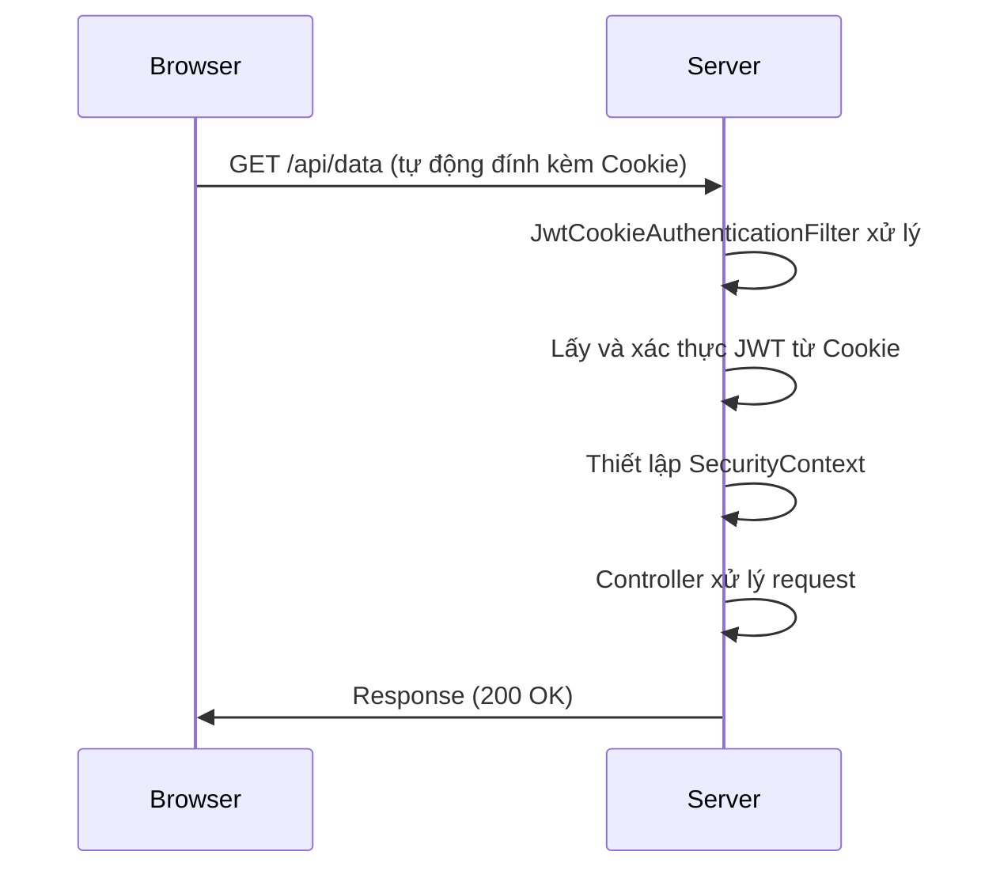

# Lưu trữ Token trong Cookie: Hướng dẫn Toàn diện và An toàn

## 1. Khái niệm: Token trong Cookie là gì?

Hãy tưởng tượng bạn đến một khu vui chơi và nhận được một chiếc vòng tay khi vào cổng. Chiếc vòng tay này là "vé thông hành" của bạn. Mỗi khi muốn chơi một trò nào đó, bạn chỉ cần giơ vòng tay ra để máy quét xác nhận.

Trong thế giới web, **Token** (như JWT) cũng giống như chiếc vòng tay đó. Sau khi bạn đăng nhập, server sẽ cấp cho bạn một Token.

**Lưu Token trong Cookie** giống như việc bạn cất chiếc vòng tay đó vào một chiếc túi đặc biệt (là **Cookie**) mà trình duyệt web luôn mang theo bên mình. Mỗi khi bạn truy cập một trang mới hoặc thực hiện một hành động, trình duyệt sẽ **tự động** "giơ" chiếc vòng tay trong túi ra cho server xem. Server nhìn vào vòng tay, xác nhận bạn là ai và bạn được phép làm gì, mà không cần bạn phải nhập lại mật khẩu mỗi lần.

## 2. So sánh: Cookie vs. Local Storage

Đây là hai nơi phổ biến nhất để lưu trữ token phía client. Việc lựa chọn đúng phương pháp có ảnh hưởng lớn đến bảo mật.

| Tiêu chí | ✅ Cookie (với cờ bảo mật) | ❌ Local Storage |
|---|---|---|
| **Bảo mật XSS** | **Rất cao.** Với cờ `HttpOnly`, JavaScript không thể đọc được token, gần như vô hiệu hóa việc đánh cắp token qua XSS. | **Rất thấp.** Bất kỳ đoạn script nào trên trang cũng có thể đọc và đánh cắp token. |
| **Bảo mật CSRF** | **Thấp (cần phòng chống).** Cần sử dụng cờ `SameSite=Strict` hoặc `Lax` để giảm thiểu. | **Cao.** Không tự động gửi đi, nên miễn nhiễm với CSRF. |
| **Tự động gửi** | **Có.** Trình duyệt tự động đính kèm vào mỗi request. | **Không.** Phải dùng JavaScript để lấy token và thêm vào header `Authorization`. |
| **Hết hạn** | **Có.** Có thể đặt thời gian hết hạn tự động. | **Không.** Tồn tại vĩnh viễn cho đến khi bị xóa thủ công. |
| **Lưu trữ** | Khoảng 4KB. | Khoảng 5-10MB. |

**Kết luận so sánh:** Nếu ứng dụng của bạn là một trang web truyền thống hoặc SPA được phục vụ từ cùng domain với API, **sử dụng Cookie với cờ `HttpOnly` và `SameSite` là phương pháp an toàn và được khuyến nghị nhất.**

## 3. Hướng dẫn triển khai với Spring Boot 3.x

Chúng ta sẽ xây dựng một ví dụ hoàn chỉnh về đăng nhập, tạo JWT, lưu vào một cookie an toàn, và xác thực các request tiếp theo.

### 3.1. Các cờ bảo mật cho Cookie (Best Practices)

-   **`HttpOnly=true`**: **BẮT BUỘC.** Ngăn JavaScript truy cập cookie, chống XSS.
-   **`Secure=true`**: **BẮT BUỘC** trong production. Chỉ gửi cookie qua HTTPS.
-   **`SameSite=Strict` hoặc `Lax`**: **BẮT BUỘC.** Chống CSRF. `Strict` là an toàn nhất. `Lax` là một sự cân bằng tốt.
-   **`Path=/`**: Đảm bảo cookie có hiệu lực trên toàn bộ trang web.
-   **`Max-Age` / `Expires`**: Đặt thời gian sống cho cookie, thường bằng với thời gian sống của token.

### 3.2. Bước 1: Service tạo và xác thực JWT

(Giả sử bạn đã có một `JwtService` có khả năng tạo và xác thực token).

### 3.3. Bước 2: Controller xử lý đăng nhập và tạo Cookie

Sử dụng `ResponseCookie` của Spring để tạo cookie một cách hiện đại và an toàn.

```java
// File: controller/AuthController.java
@RestController
@RequestMapping("/auth")
public class AuthController {
    private final AuthenticationManager authenticationManager;
    private final JwtService jwtService;

    // ... constructor ...

    public record LoginRequest(String username, String password) {}

    @PostMapping("/login")
    public ResponseEntity<String> login(@RequestBody LoginRequest loginRequest) {
        // 1. Xác thực người dùng
        Authentication authentication = authenticationManager.authenticate(
            new UsernamePasswordAuthenticationToken(loginRequest.username(), loginRequest.password())
        );

        // 2. Tạo JWT
        UserDetails userDetails = (UserDetails) authentication.getPrincipal();
        String jwt = jwtService.generateToken(userDetails);

        // 3. Tạo một ResponseCookie an toàn
        ResponseCookie cookie = ResponseCookie.from("accessToken", jwt)
                .httpOnly(true)
                .secure(true)       // Chỉ true trong môi trường HTTPS
                .sameSite("Strict") // Hoặc "Lax"
                .path("/")
                .maxAge(Duration.ofHours(1))
                .build();

        // 4. Trả về response với header Set-Cookie
        return ResponseEntity.ok()
                .header(HttpHeaders.SET_COOKIE, cookie.toString())
                .body("Đăng nhập thành công!");
    }
}
```

### 3.4. Bước 3: Filter đọc Token từ Cookie

Filter này sẽ chạy trước, tìm cookie chứa token, xác thực nó và thiết lập `SecurityContext`.

```java
// File: filter/JwtCookieAuthenticationFilter.java
@Component
public class JwtCookieAuthenticationFilter extends OncePerRequestFilter {
    private final JwtService jwtService;
    private final UserDetailsService userDetailsService;

    // ... constructor ...

    @Override
    protected void doFilterInternal(HttpServletRequest request, HttpServletResponse response, FilterChain filterChain) 
            throws ServletException, IOException {
        
        // 1. Lấy token từ cookie "accessToken"
        getJwtFromCookie(request).ifPresent(token -> {
            try {
                // 2. Xác thực token
                String username = jwtService.extractUsername(token); // Giả sử phương thức này tồn tại

                // 3. Nếu hợp lệ, tải thông tin người dùng và thiết lập SecurityContext
                if (username != null && SecurityContextHolder.getContext().getAuthentication() == null) {
                    var userDetails = userDetailsService.loadUserByUsername(username);
                    if (jwtService.isTokenValid(token, userDetails)) { // Giả sử phương thức này tồn tại
                        var authentication = new UsernamePasswordAuthenticationToken(
                            userDetails, null, userDetails.getAuthorities()
                        );
                        authentication.setDetails(new WebAuthenticationDetailsSource().buildDetails(request));
                        SecurityContextHolder.getContext().setAuthentication(authentication);
                    }
                }
            } catch (Exception e) {
                logger.error("Không thể xác thực JWT từ cookie: {}", e.getMessage());
            }
        });

        filterChain.doFilter(request, response);
    }

    private Optional<String> getJwtFromCookie(HttpServletRequest request) {
        if (request.getCookies() == null) {
            return Optional.empty();
        }
        return Arrays.stream(request.getCookies())
                .filter(cookie -> "accessToken".equals(cookie.getName()))
                .map(Cookie::getValue)
                .findFirst();
    }
}
```

### 3.5. Bước 4: Cấu hình Spring Security

```java
// File: config/SecurityConfig.java
@Configuration
@EnableWebSecurity
public class SecurityConfig {
    private final JwtCookieAuthenticationFilter jwtCookieAuthFilter;

    // ... constructor ...

    @Bean
    public SecurityFilterChain securityFilterChain(HttpSecurity http) throws Exception {
        http
            .csrf(csrf -> csrf.disable()) // Nên bật CSRF nếu dùng cookie cho web app
            .sessionManagement(session -> session.sessionCreationPolicy(SessionCreationPolicy.STATELESS))
            .authorizeHttpRequests(authz -> authz
                .requestMatchers("/auth/login").permitAll()
                .anyRequest().authenticated()
            )
            // Thêm filter của chúng ta vào đúng vị trí
            .addFilterBefore(jwtCookieAuthFilter, UsernamePasswordAuthenticationFilter.class);

        return http.build();
    }
    
    // ... các bean khác như AuthenticationManager, PasswordEncoder, UserDetailsService ...
}
```

## 4. Sơ đồ luồng hoạt động

**Luồng đăng nhập:**
```mermaid
sequenceDiagram
    participant User
    participant Browser
    participant Server
    
    User->>Browser: Nhập username/password
    Browser->>Server: POST /auth/login
    Server->>Server: Xác thực thành công
    Server->>Server: Tạo JWT
    Server->>Browser: Response (Set-Cookie: accessToken=...; HttpOnly; Secure; SameSite=Strict)
    Browser->>Browser: Lưu Cookie
```

**Luồng truy cập tài nguyên được bảo vệ:**


## 5. Kết luận

Sử dụng cookie để lưu trữ token là một phương pháp **mạnh mẽ và an toàn** nếu được cấu hình đúng. Chìa khóa thành công nằm ở việc áp dụng nghiêm ngặt các cờ bảo mật: **`HttpOnly`**, **`Secure`**, và **`SameSite`**. Bằng cách này, bạn có thể tận dụng sự tiện lợi của cookie mà vẫn giảm thiểu được các rủi ro bảo mật phổ biến như XSS và CSRF, tạo ra một giải pháp xác thực vừa an toàn vừa thân thiện với người dùng.
